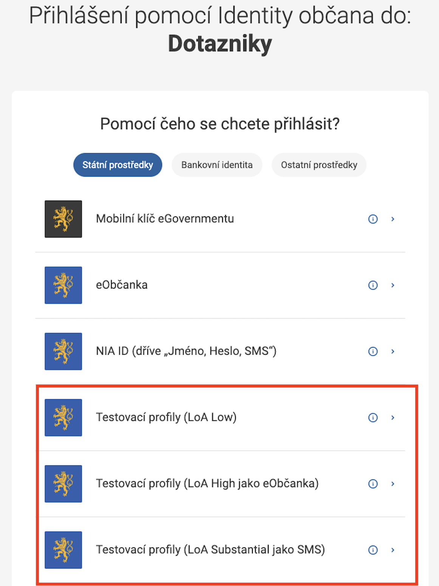
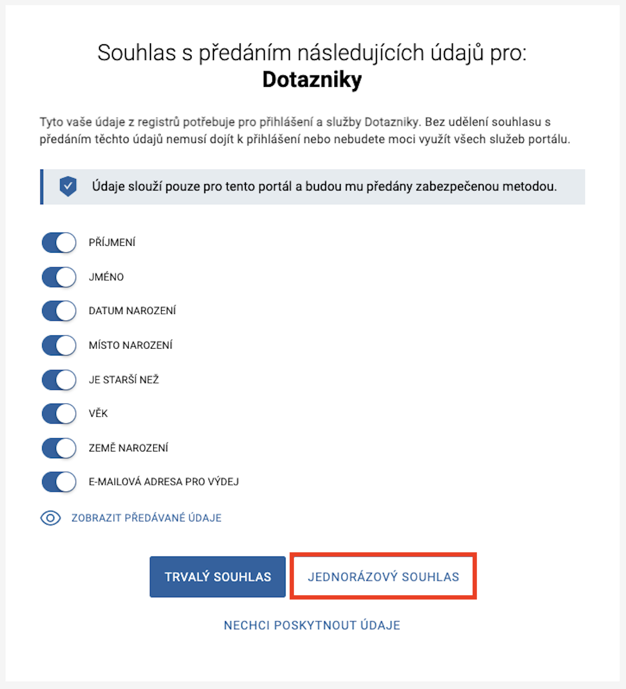
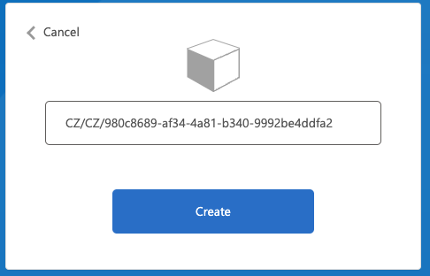
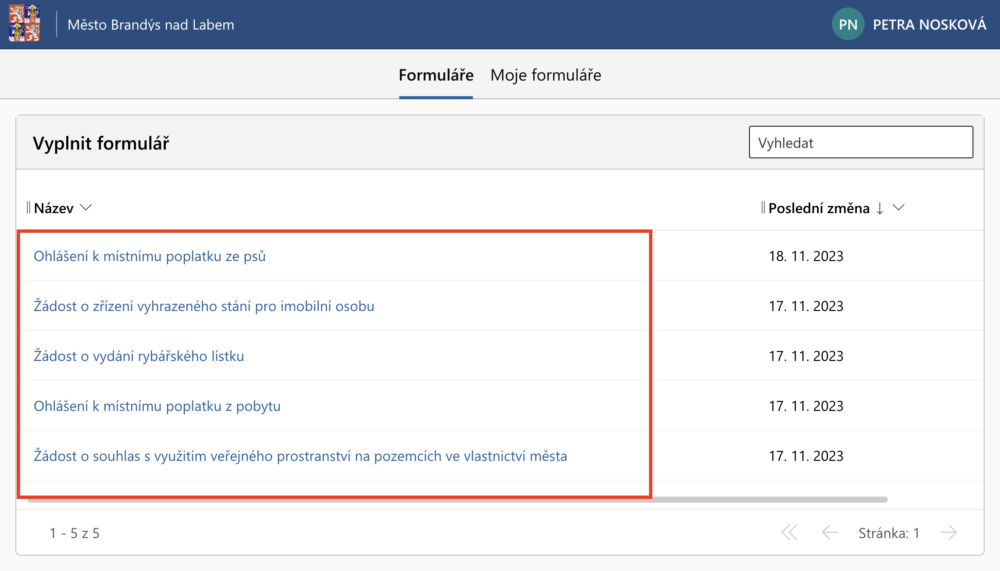
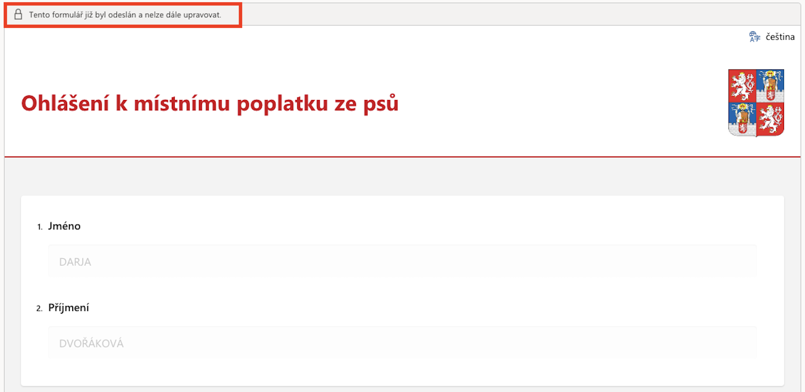
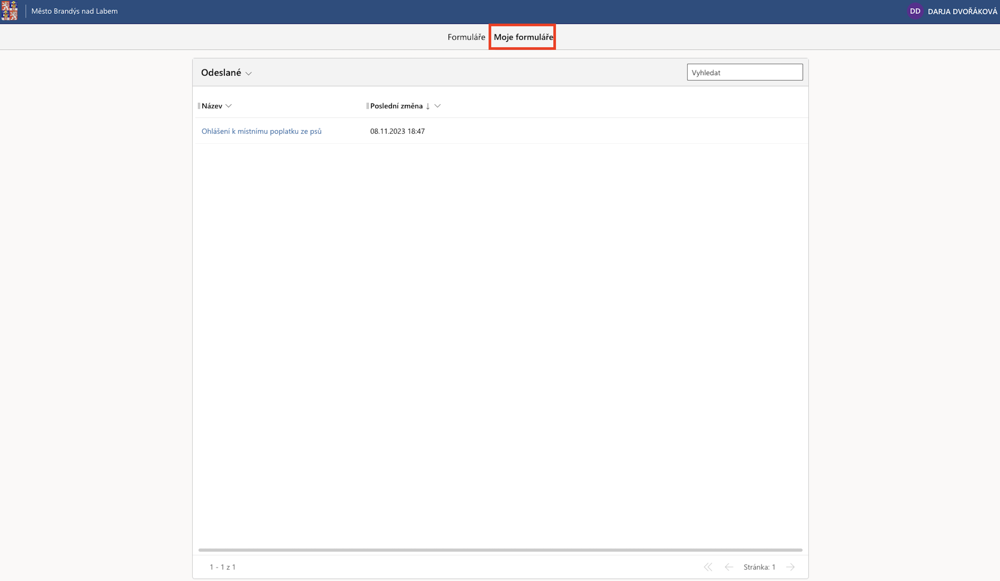
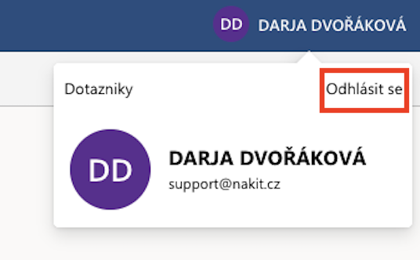

# Přístup do občanského portálu

1. Otevřete webovou adresu [https://brych-dotazniky.apps.talxis.com/](https://brych-dotazniky.apps.talxis.com/).
2. Po načtení dojde k zobrazení přihlašovací stránky identity občana. Pro pokračování zvolte jednu z nabízených možností testovacích profilů.

    

3. Po zvolení jedné z možností dojde k zobrazení dialogu pro výběr testovacího profilu. Pro pokračování stačí vybrat jakýkoliv z nabízeních profilů a kliknout na tlačítko *Přihlásit*.

    

4. Následně Vám bude zobrazen dialog pro udělení souhlasu s předáním údajů. Na tomto dialogu není nutné nic měnit a stačí pokračovat kliknutím na tlačítko *JEDNORÁZOVÝ SOUHLAS*.

    

5. Pokud dojde k zobrazení následujícího dialogu, pokračujte prosím kliknutím na tlačítko *Create*.

    

6. Následně budete přesměrováni do občanského portálu pro vyplnění formulářů. Formulář můžete začít vyplňovat rozkliknutím odkazu konkrétního formuláře.

    

7. Je možné, že po rozkliknutí formuláře se Vám nad formulářem zobrazí hláška *Tento formulář již byl odeslán a nelze dále upravovat.* Formulář již tím pádem před Vámi vyplnil jiný tester. V tomto případě prosím zkuste zvolit jiný formulář anebo se odhlaště z portálu (viz bod 9) a přihlašte se pomocí jiného testovacího profilu.

    

8. Všechny Vaše odeslané a rozpracované formuláře si můžete zobrazit pomocí nabídky *Moje formuláře*.

    

9. Pro odhlášení z portálu je nutné kliknout na jméno testovacího profilu v pravém horním rohu portálu a kliknout na možnost *Odhlásit se*.

    

   