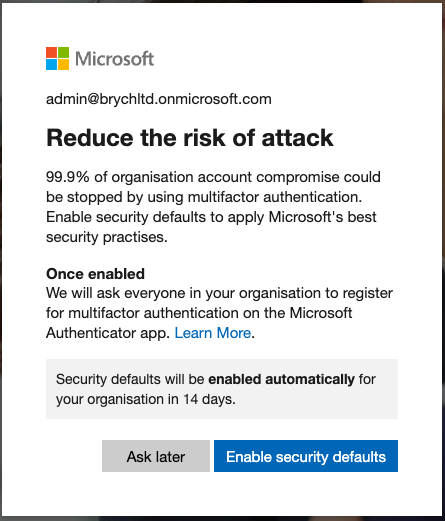
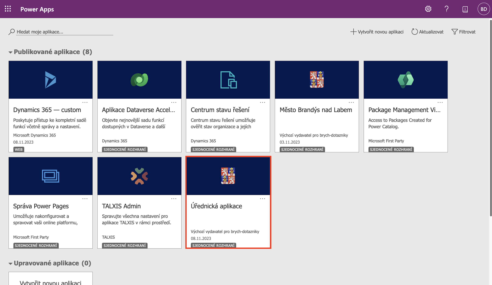
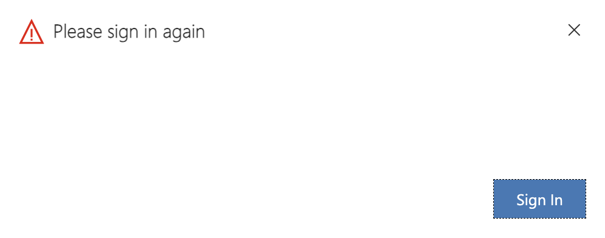
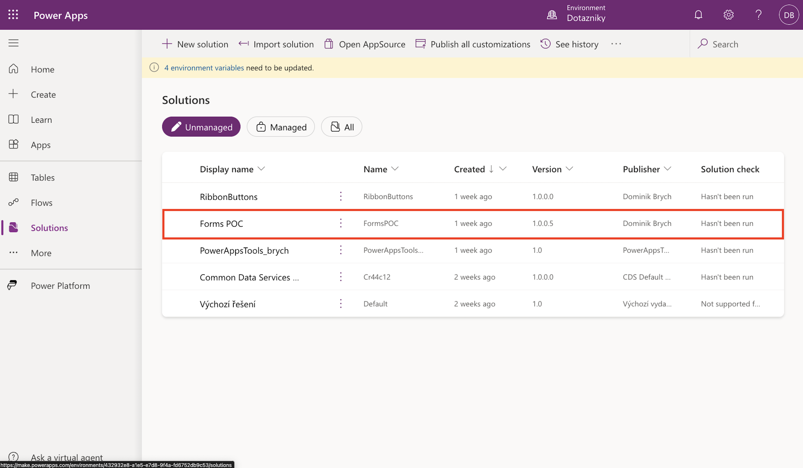

# Přístup do úřednické aplikace

1. Přepněte prohlížeč do [anonymního režimu](https://support.google.com/chrome/answer/95464?hl=cs&co=GENIE.Platform%3DDesktop). Existující přihlášení do jiných produktů Microsoftu totiž mohou způsobovat konflikty během přihlášení skrze jinou organizaci.

2. Otevřete webovou adresu [https://brych-dotazniky.crm4.dynamics.com/](https://brych-dotazniky.crm4.dynamics.com/)
3. Do přihlašovacího dialogu zadejte **admin@brychltd.onmicrosoft.com** jako emailovou adresu a **lol@pass1** jako heslo.
4. Pokud po zadání přihlašovacích údajů dojde k zobrazení následujícího dialogu, pokračujte prosím stisknutím tlačítka *Ask later*.
 
    

> **_POZNÁMKA:_**  Microsoft se za každou cenu snaží uživatele přesvědčit k zapnutí dvoufázového ověření. Je tak možné, že se Vám tlačítko *Ask later* nezobrazí. V takovém případě by mělo situaci vyřešit přenačtení stránky. Pokud se Vám stále nepůjde do aplikace přihlásit, konktaktuje mě prosím na adrese bryd00@vse.cz

5. Po přihlášení dojde k zobrazení obrazovky s dostupnými aplikacemi. Úřednickou aplikaci lze otevřít kliknutím na korespondující volbu.

    

6. Pokud po chvíli dojde k zobrazení následujícího dialogu, pokračujte stisknutím tlačítka *Sign in*.
 
 
        

 

Pokud si přejete aplikaci zobrazit v návrhovém prostředí Power Apps, je nutné po přihlášení navšívit tuto [webovou adresu](https://make.powerapps.com/environments/432932e8-a1e5-e7d8-9f4a-fd6752db9c53/home?utm_source=office&utm_medium=app_launcher&utm_campaign=office_referrals). Úřednická aplikace spolu s veškerými závislostmi je součástí Power Apps řešení `Forms POC`.

